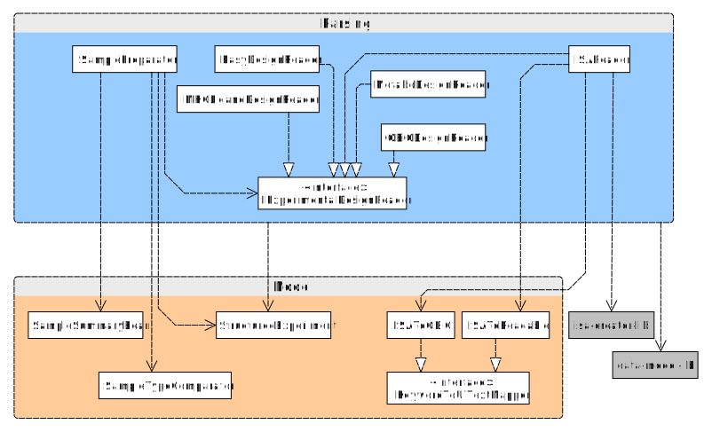

<div align="center">
# Experimental Design Library

<i>Library for parsing of different experimental design formats and mapping to openbis properties </i>

[](https://github.com/qbicsoftware/experimental-design-lib/actions/workflows/build_package.yml)
[](https://github.com/qbicsoftware/experimental-design-lib/actions/workflows/run_tests.yml)
[](https://github.com/qbicsoftware/experimental-design-lib/actions/workflows/codeql-analysis.yml)
[](https://github.com/qbicsoftware/experimental-design-lib/releases)

[](https://github.com/qbicsoftware/experimental-design-lib/blob/main/LICENSE)


</div>

## How to run

Create a runable version of this code with maven and java 8:

```
mvn clean package
```

The JAR file will be created in the ``/target`` folder

## How to use

This library is not hosted on maven central. To use it, you have to include our artifact repository to your pom.

```xml
<repositories>
    <repository>
        <releases>
            <enabled>true</enabled>
            <updatePolicy>always</updatePolicy>
            <checksumPolicy>fail</checksumPolicy>
        </releases>
        <snapshots>
            <enabled>false</enabled>
        </snapshots>
        <id>nexus-releases</id>
        <name>QBiC Releases</name>
        <url>https://qbic-repo.qbic.uni-tuebingen.de/repository/maven-releases</url>
    </repository>
</repositories>
```

Then include this library as an artifact.
```xml
<dependency>
    <groupId>life.qbic</groupId>
    <artifactId>experimental-design-lib</artifactId>
    <version>[version-number]</version>
</dependency>
```

## Data Models and Examples

This library contains multiple parsers for different experimental design formats.
The SamplePreparator class uses one experimental design reader (parser) and returns experiment and sample representations used in different other portlets.
An overview of the different parsers and interfaces can be seen here:



The library isa-creator-lib is used to enable parsing of the ISA-Tab format.

Example use:

```java
// create a new reader for the "Easy Design" (no measurement technology-specific
// data, only identifiers and data about species, tissues sample types)
EasyDesignReader reader = new EasyDesignReader();

// create sample preparator class
SamplePreparator preparator = new SamplePreparator();

// parse a TSV and return a hierarchical structure (e.g.
// species - tissues - measured samples) of the samples (each list of samples is one level)
List<List<ISampleBean>> structure = preparator.processTSV("design.tsv", reader, false);

// set "true", to create an experimental design graph based on species, tissues, or
// experimental factors defined in the TSV
preparator.processTSV("design.tsv", reader, true);

// return the graph structure
StructuredExperiment graphStructure = preparator.getSampleGraph();

// get a map that summarizes the number of similar samples based on an experimental factor
Map<String, List<SampleSummary>> factorToSampleMap = graphStructure.getFactorsToSamples();

// get sample summaries grouped by genotype (if genotype was defined)
List<SampleSummary> samplesByGenotype = factorToSampleMap.get("genotype");
```
